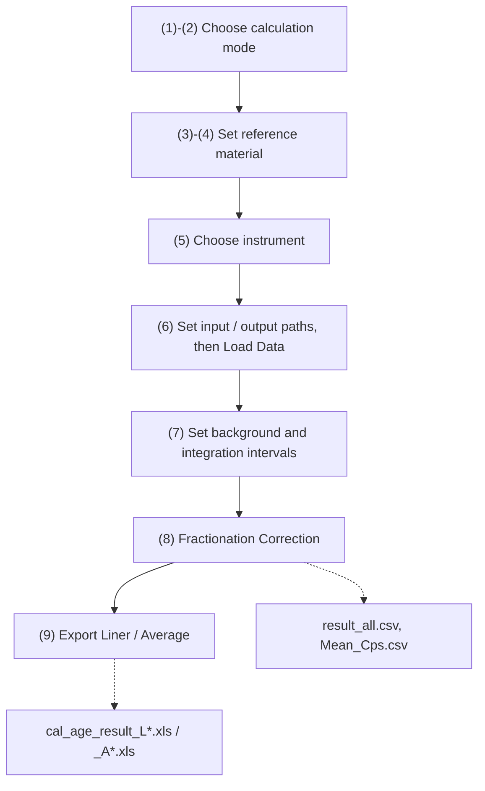

# Isoclock

**Offline data reduction for LA-ICP-MS U–Th–Pb dating of minerals with variable common Pb** —
apatite, titanite, wolframite and other hydrothermal or accessory phases.

Isoclock takes raw mass-spectrometer files through the whole workflow: data import and
inspection → background correction and outlier filtering → common-Pb correction on the
reference material → downhole fractionation calibration → Sample-Standard-Bracketing
ages. It runs from the command line or through a GUI, reads raw files from Thermo,
Agilent and Element instruments, and can be extended with further export formats.

> **Fork notice.** This repository is a maintained fork of
> [sndjgm/Isoclock](https://github.com/sndjgm/Isoclock). The software and the scientific
> method are by **Guoqi Liu** (East China University of Technology, sndjgm@foxmail.com).
> This fork does not change any numerical result — it removes duplicated code, speeds up
> file reading, and fixes packaging and documentation problems.
> See [Changes in this fork](#changes-in-this-fork).

---

## Quick start

```bash
git clone https://github.com/sndjgm/Isoclock.git     # or download the ZIP
cd Isoclock

python -m pip install -r requirements.txt            # install dependencies
python Isoclock2.0.py                                # start the program
```

Notes:

- **Python 3.9** — the version this software is developed and tested with.
  On Windows use `py -3.9 -m pip install -r requirements.txt`.
- **macOS / Linux** — use `python3`, and install Tk first
  (`sudo apt install python3-tk`, or `brew install python-tk`). Without it you get
  `ModuleNotFoundError: No module named 'tkinter'`.
- **Windows without Python** — run the prebuilt `Isoclock 2.0.exe`, see [Downloads](#downloads).
- Downloading the ZIP gives a folder named `Isoclock-main`, so adjust the `cd` above,
  or rename it to `Isoclock`.

### Read this before your first run

These four points cause most of the errors new users run into:

1. **The input and output folders must be different.** The program will not run otherwise.
2. **The input folder must contain the raw signal files and nothing else.** Any other file
   (an unrelated CSV, for instance) makes it stop with an error.
3. **Process one batch per run.** Restart the program and choose a new output folder before
   starting the next batch.
4. **The raw data must contain 204Pb, 206Pb, 207Pb, 208Pb, 232Th and 238U.** A missing
   channel causes an error.

## Workflow



The same steps click by click. The numbers match the labelled areas of the interface
(user manual, Fig. 3):

| # | Area | What to do |
|---|---|---|
| (1)–(2) | Calculation mode | Choose **standard Cor** if the reference material carries appreciable common Pb (apatite, titanite, wolframite …), **standard not Cor** otherwise (most zircon). The dark-blue block selects the common-Pb correction method: 207Pb and 204Pb after Chew et al. (2014), 208Pb after Zack et al. (2011). |
| (3)–(4) | Reference material | **Setting Standard** → **S&K** (Stacey & Kramers, 1975) or **User**. The reference-material name must match the name shown by the software exactly. |
| (5) | Instrument | **Thermo** (no list file needed, names are read automatically), **Agilent** (`sequence.csv` in the `sequence.d` folder, plus a list file — see below), **Element** (`.fin` holds the sequence, `.fin2` the signal data). |
| (6) | Input / output | Set both paths, then **Load Data**. With **Agilent** a file dialog opens — select the list file there. |
| (7) | Background & integration | Click a sample in the left-hand list to draw its signal, then **Set (All)** or **Set (Single)** to define the background and signal windows. |
| (8) | Ratios | **Fractionation Correction** writes `result_all.csv` and `Mean_Cps.csv` to the output folder. |
| (9) | Ages | **Export (Liner)** applies Sample-Standard-Bracketing with instrument-drift correction and writes `cal_age_result_L*.xls`. **Export (Average)** writes `cal_age_result_A*.xls` without drift correction. |

**Agilent list file.** An Excel workbook whose worksheet must be named `Sheet1`; column 1
is the folder or file name, column 2 is the sample or reference-material name.

**Converting Thermo exports.** `Thermo_to_Agilent_Convertdata.py` rewrites Thermo output
into the Agilent layout, if you prefer to work that way.

## Output files

| File | Content |
|---|---|
| `result_all.csv` | Per-sample isotope ratios and ages. First line is the header. |
| `Mean_Cps.csv` | Mean count rates per sample, per channel. |
| `cal_age_result_L*.xls` | Ages and ratios with Sample-Standard-Bracketing drift correction (Liner). |
| `cal_age_result_A*.xls` | The same without drift correction (Average). |
| Signal diagrams | Written to the output folder as each sample is selected in step (7). |

See the manual for a description of the columns (Fig. 4).

## Downloads

| Item | Where |
|---|---|
| Video walkthrough | https://www.youtube.com/watch?v=-MocFvCSmBc |
| User manual, v2.0 | [`User manuals of Isoclock v2.0 .pdf`](<User manuals of Isoclock v2.0 .pdf>) — in this repository |
| User manual, extended | [`Isoclock user manual_20231001222453.pdf`](<Isoclock user manual_20231001222453.pdf>) — in this repository |
| Prebuilt Windows `.exe` | https://www.researchgate.net/publication/371012414_Isoclock20 |
| Demo video | https://www.researchgate.net/publication/371039144_Demo_of_Isoclock20 |

The `.exe` is distributed through ResearchGate, as documented in the user manual. The
OneDrive mirrors previously listed here no longer resolve to a direct download — they now
land on a Microsoft sign-in page — so they have been dropped. If you cannot reach the
`.exe` package, run the software from source: it needs nothing beyond `requirements.txt`.

## Known issues

Known problems, listed so that results can be read with the necessary care.

1. **207Pb/206Pb age inversion** (`Age76Pb` in `Isoclock2.0.py`). The convergence test is
   evaluated against a value computed before the loop and never updated, so the loop always
   runs a fixed 10 iterations. Compared with a high-precision solution the results are exact
   below about 600 Ma, but the deviation grows to roughly +35 Ma (1.7%) near 2.1 Ga. Ages in
   the 1.5–2.2 Ga range should be treated with caution.
2. **`ZeroDivisionError` in the 204Pb correction path.** When the 204Pb method is selected
   and the net count rate of mass 204 is zero, the calculation stops with an error.
3. **No Hg correction applied to mass 204.** The term intended to remove the 204Hg
   contribution evaluates to zero (`np.average(x) - np.average(x)`) and its result is never
   used. This is harmless if the raw files were already corrected for Hg by the instrument
   software; otherwise it biases the 204Pb correction methods and the 208Pb/204Pb column.
   Please check how your data were exported.

Corrections and bug reports are welcome.

## Changes in this fork

Upstream is unchanged in intent; only engineering problems are addressed.

| Change | Why |
|---|---|
| 5 duplicated reduction functions merged into one shared skeleton (−500 lines) | Behaviour is bit-for-bit identical, verified across 690 output cells |
| `loaddata` reads only the 8 needed columns as `float` | 39 ms → 9.5 ms per sample (4.1×); the old code parsed every column as text first |
| `requirements.txt` corrected | It listed `tkinter`, `csv`, `json`, `logging`, `warnings` (standard library) and `PIL`, so `pip install -r` failed for everyone |
| `LISENSE` → `LICENSE`, completed to the full Apache 2.0 text | GitHub and Zenodo did not recognise the licence |
| `eval(seq.pop())` in the converter replaced | Executing strings taken from CSV filenames is arbitrary code execution |
| `except` blocks now log tracebacks; unhandled Tk callbacks are reported | Errors used to vanish silently, especially from a packaged `.exe` |
| 10 unused imports removed | They pulled in `pyDes`, `openpyxl` and `base64` for nothing |

## References

Chew, D.M., Petrus, J.A., Kamber, B.S., 2014. U–Pb LA–ICPMS dating using accessory mineral
standards with variable common Pb. *Chemical Geology* 363, 185–199.

Stacey, J.S., Kramers, J.D., 1975. Approximation of terrestrial lead isotope evolution by a
two-stage model. *Earth and Planetary Science Letters* 26, 207–221.

The 208Pb correction method follows Zack et al. (2011).

## License and citation

Released under the Apache License 2.0 — see [LICENSE](LICENSE).

Citation metadata is in [CITATION.cff](CITATION.cff); GitHub's *Cite this repository* button
reads it directly.
